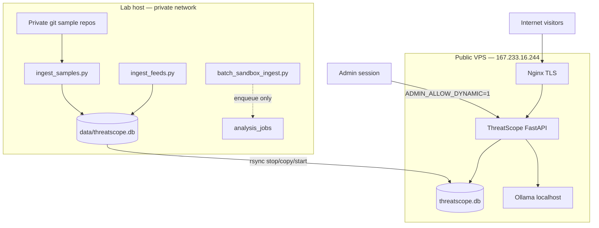

# Two-tier architecture: lab ingest + public VPS

ThreatScope splits **heavy / sensitive work** (sample repos, dynamic detonation, batch sandbox) on a **lab host** from a **public lookup VPS** that serves static analysis, feed-backed IOC lookups, and admin-only optional dynamic runs.



## Roles

| Tier | Host | Responsibilities |
|------|------|------------------|
| **Lab** | Homelab / workstation | `ingest_samples.py`, optional `batch_sandbox_ingest.py`, full `SANDBOX_BACKEND`, feed ingest, DB authoring |
| **Public VPS** | Internet-facing | `THREATSCOPE_PUBLIC=1`, `SANDBOX_BACKEND=off` by default, OSINT feeds, static + YARA uploads, hash lookups synced from lab |

## Data flow

1. **Feeds** — `ingest_feeds.py` on lab or VPS (cron); public VPS typically runs this after deploy.
2. **Sample hashes** — lab only: `ingest_samples.py` → SQLite.
3. **DB sync** — [`scripts/sync-hash-db-to-production.sh`](../../scripts/sync-hash-db-to-production.sh): stop `threatscope`, copy `data/threatscope.db`, chown, restart.
4. **Dynamic analysis on VPS** — disabled for visitors; operator with admin session + `ADMIN_ALLOW_DYNAMIC=1` may opt in on file upload (still requires sandbox worker + backend on that host — usually lab only).

## Deploy public tier

```bash
export DEPLOY_SSH_PASSWORD='...'   # optional; else SSH keys
./scripts/deploy-vps-from-github.sh
```

Repo: https://github.com/kushalimdeutschland-blip/threadscope.git

## What must never run on the public VPS

- Automatic batch detonation (`batch_sandbox_ingest.py` without explicit lab confirmation)
- Cloning password-protected malware sample repos (credentials stay on lab)
- Storing raw malware samples in the web app process (unchanged: samples on disk by SHA256, dynamic via `sandbox_worker.py` only)

## Related docs

- [sample-hash-ingest.md](sample-hash-ingest.md)
- [../ops/deployment.md](../ops/deployment.md)
- [development.md](development.md)
